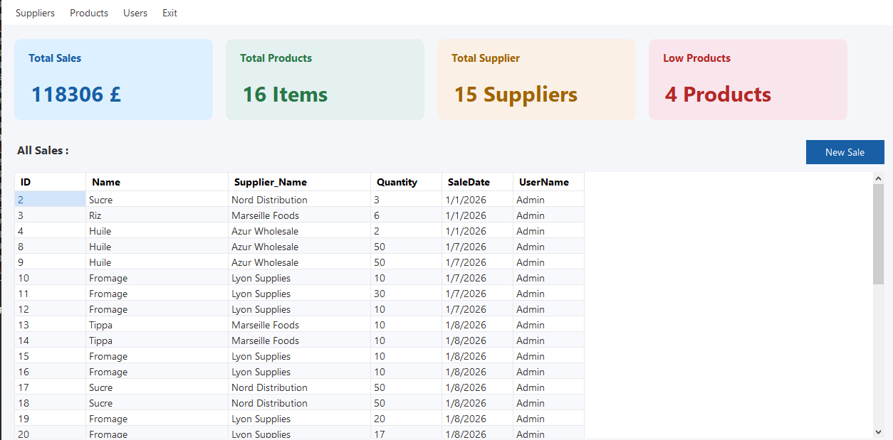

# 🛒 Retail Store Management System

A full-featured desktop application for managing retail store operations, built with **C# Windows Forms** and **SQL Server**.

---

## 📸 Screenshots

> Main Dashboard



---

## ✨ Features

- 📊 **Dashboard** — Real-time stats: total sales, products, suppliers, and low-stock alerts
- 🛍️ **Sales Management** — Record and track all sales transactions
- 📦 **Product Management** — Add, update, and monitor product inventory
- 🚚 **Supplier Management** — Manage supplier information and relationships
- 👥 **User Management** — Role-based access control (Admin, Staff/Cashier, Viewer)
- 🔐 **Secure Authentication** — BCrypt password hashing + login history tracking
- 📋 **Login History** — Full audit log of user login activity
- 🔑 **Change Password** — Secure password update for any user

---

## 🏗️ Architecture

The project follows a **3-Tier Architecture**:

```
┌─────────────────────────┐
│     Presentation Layer  │  Windows Forms UI
├─────────────────────────┤
│     Business Layer      │  Logic & Validation (clsUsers, clsProducts...)
├─────────────────────────┤
│   Data Access Layer     │  ADO.NET + Stored Procedures
├─────────────────────────┤
│       SQL Server        │  Database
└─────────────────────────┘
```

---

## 🛠️ Tech Stack

| Technology | Usage |
|---|---|
| C# .NET Framework 4.7.2 | Core language |
| Windows Forms | Desktop UI |
| ADO.NET | Database access |
| SQL Server | Database |
| Stored Procedures | All DB operations |
| BCrypt.Net | Password hashing |
| MaterialSkin.2 | UI styling |

---

## 🚀 Getting Started

### Prerequisites

- Visual Studio 2019 or later
- SQL Server 2017 or later
- .NET Framework 4.7.2

### Installation

1. **Clone the repository**
   ```bash
   git clone https://github.com/Davefii/RetailStoreMangement.git
   ```

2. **Set up the database**
   - Open SQL Server Management Studio (SSMS)
   - Run the script located in `/Database/RetailDB.sql`

3. **Configure the connection string**
   - Open `DataAccessSettings/DataAccessSettings.cs`
   - Update the connection string to match your SQL Server instance:
   ```csharp
   public static string ConnictionString = "Server=YOUR_SERVER;Database=RetailDB;User Id=YOUR_USER;Password=YOUR_PASSWORD;";
   ```

4. **Build and run**
   - Open `RetailStoreMangement.sln` in Visual Studio
   - Press `F5` to build and run

---

## 👤 Default Login

| Username | Password | Role |
|---|---|---|
| Admin | admin123 | Admin |

> ⚠️ Change the default password after first login.

---

## 🔐 Security Features

- ✅ BCrypt password hashing
- ✅ Role-based access control (Admin / Staff / Viewer)
- ✅ Login history audit log
- ✅ Secure password change flow
- ✅ Input validation on all forms

---

## 📁 Project Structure

```
RetailStoreMangement/
├── BussinessLayer/          # Business logic classes
│   ├── clsUsers.cs
│   ├── clsProducts.cs
│   ├── clsSales.cs
│   └── clsSuppliers.cs
├── DataAccessLayer/         # ADO.NET data access
│   ├── DataUsers.cs
│   ├── DataProduct.cs
│   ├── DataSeles.cs
│   └── DataSupplier.cs
├── DataAccessSettings/      # Connection string config
├── User/                    # User management forms
├── Sales/                   # Sales forms
├── Products/                # Product forms
├── Suppliers/               # Supplier forms
└── Database/                # SQL scripts
```

---

## 🤝 Contributing

Contributions are welcome! Feel free to open an issue or submit a pull request.

---

## 📄 License

This project is licensed under the MIT License.

---

## 👨‍💻 Author

**Davefii**
- GitHub: [@Davefii](https://github.com/Davefii)
- LinkedIn: [Zakaria Boukhlekhal](https://www.linkedin.com/in/zakaria-boukhelkhal-499375369)
